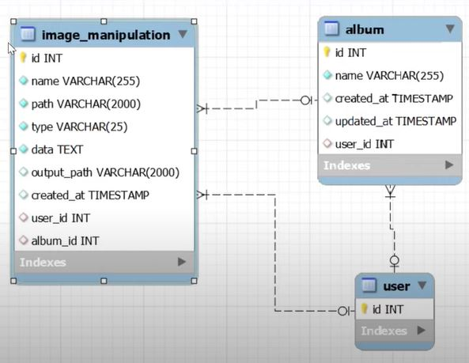

#####1. Installation Project Create Database
composer create-project --prefer-dist  laravel/laravel .  

Edit  env. file  

mysql -u root -p  
create database lar8_img_manipulation_rest_api; `db_name;`  
`drop database db_name`;     
show databases;   
use db_name;  
show tables;  
drop table table_name;  
exit   

php artisan migrate
 
  
 
npm install  
npm run dev  

git init  
git add .  
git commit –m "Comment"  
git remote add origin https://github.com/SergeyHub/repository-name.git  
git push -u origin master  

#####2. Add album model, migration and implement CRUD   
php artisan make:model Album -m       
`migrations/2022_02_12_231026_create_albums_table.php`  
```
    $table->id();
    $table->string('name',255);
    $table->timestamps();
    $table->foreignIdFor(\App\Models\User::class, 'user_id')->nullable();

```
php artisan make:model ImageManipulation -m   
`migrations/2022_02_13_004313_create_image_manipulations_table.php`
```
    $table->id();
    $table->string('name',255);
    $table->string('path',2000);
    $table->string('type',25);
    $table->text('data');
    $table->string('output_path',2000)->nullable();
    $table->timestamp('created_at')->nullable();
    $table->foreignIdFor(\App\Models\User::class, 'user_id')->nullable();
    $table->foreignIdFor(\App\Models\Album::class, 'album_id')->nullable();
```
php artisan migrate  
php artisan make:controller AlbumController  --model=Album --requests --api     
php artisan migrate:rollback  
php artisan migrate  
`api.php`
```
   use App\Http\Controllers\V1\AlbumController;
      
   Route::prefix('v1')->group(function(){
       Route::apiResource('album', AlbumController::class);
   });

```
php artisan make:resource V1\\AlbumResource  
#####3.Implement image resize 
Create ImageManipulation model, migration and controller.  
Create ResizeImageRequest class  
Install `intervention/image` package  
Implement image resize and save in the database  
php artisan make:controller V1\\ImageManipulationController --model=ImageManipulation --requests --api  
php artisan make:resource V1\\ImageManipulationResource  
