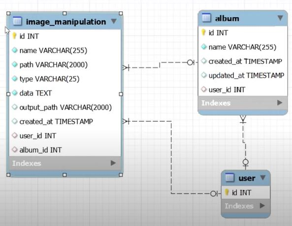

####Installation Project. How use.
1. Clone the project  
2. Navigate to the project root directory using command line  
3. Run composer install  
4. Copy .env.example into .env file  
5. Create database for project  
6. Run `php artisan key:generate --ansi`  
7. Run `php artisan migrate`  
8. Run `php artisan serve` which will start the server at http://localhost:8000  
9. Import `readme/postman` file in postman and test locally

```
  <VirtualHost *:80>  
      ServerName yourproductiondomain.com  
      ServerAlias www.yourproductiondomain.com
      DocumentRoot /project-installation-path/public
  
      <Directory "/project-installation-path/public`">
          Options -Indexes +FollowSymLinks
          AllowOverride All
          Require all granted
      </Directory>
  
      ErrorLog /path-to-logs-folder/error.log
      CustomLog /path-to-logs-folder/access.log combined
  </VirtualHost>
  ```
####Main stages of development
How to Build REST API in Laravel 8  
`https://www.youtube.com/watch?v=bvvVX9Pny84`    
#####1. Installation Project Create Database

`composer create-project --prefer-dist  laravel/laravel .`    
Edit  env. file  

mysql -u root -p  
create database lar8_img_manipulation_rest_api; `db_name;`  
`drop database db_name`;     
show databases;   
use db_name;  
show tables;  
drop table table_name;  
exit   

php artisan migrate
 
  
 
npm install  
npm run dev  

git init  
git add .  
git commit –m "Comment"  
git remote add origin https://github.com/SergeyHub/repository-name.git  
git push -u origin master  

#####2. Add album model, migration and implement CRUD   
php artisan make:model Album -m       
`migrations/2022_02_12_231026_create_albums_table.php`  
```
    $table->id();
    $table->string('name',255);
    $table->timestamps();
    $table->foreignIdFor(\App\Models\User::class, 'user_id')->nullable();

```
php artisan make:model ImageManipulation -m   
`migrations/2022_02_13_004313_create_image_manipulations_table.php`
```
    $table->id();
    $table->string('name',255);
    $table->string('path',2000);
    $table->string('type',25);
    $table->text('data');
    $table->string('output_path',2000)->nullable();
    $table->timestamp('created_at')->nullable();
    $table->foreignIdFor(\App\Models\User::class, 'user_id')->nullable();
    $table->foreignIdFor(\App\Models\Album::class, 'album_id')->nullable();
```
php artisan migrate  
php artisan make:controller AlbumController  --model=Album --requests --api     
php artisan migrate:rollback  
php artisan migrate  
`api.php`
```
   use App\Http\Controllers\V1\AlbumController;
      
   Route::prefix('v1')->group(function(){
       Route::apiResource('album', AlbumController::class);
   });

```
php artisan make:resource V1\\AlbumResource  
`git pull --rebase origin master`  
`git push -u origin master`  
#####3.Implement image resize 
Create ImageManipulation model, migration and controller.  
Create ResizeImageRequest class  
Install `intervention/image` package  
Implement image resize and save in the database  
`php artisan make:controller V1\\ImageManipulationController --model=ImageManipulation --requests --api`  
`php artisan make:resource V1\\ImageManipulationResource` 

image.intervention.io  
`composer require intervention/image`   

#####4. Create ImageManipulation model, migration and controller. Create ResizeImageRequest class    

#####5.Implement Registration and Login. Install Breeze Package     
Install Breeze Package  
`composer require laravel/breeze --dev`  
`php artisan breeze:install`  
`npm install`  
`npm run dev`  
`git push -u origin master`   

#####6. Sanctum. Edit api.php. Generate Access Token
Create DashboardController  
`php artisan make:controller DashboardController`  
Edit web.php. Add DashBoardController routes.

#####7. Edit dashboard.blade.php
Create button-link.blade.php  token-create.blade token-show.blade  

#####8. Edit dashboard.blade.php
